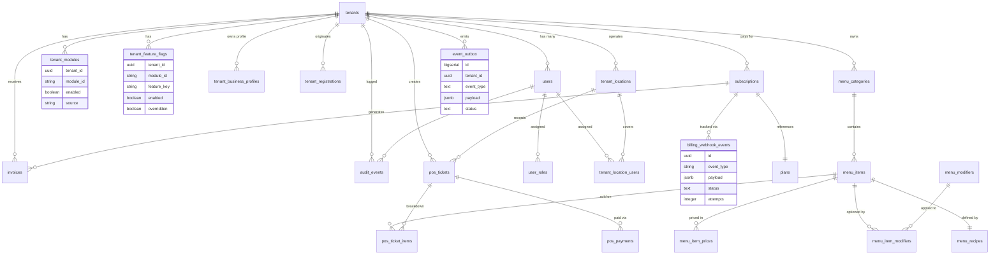

# Database Schema Guide

Nova's PostgreSQL instance is organized as a modular monolith. Tables are grouped by the same functional boundaries as the codebase�identity, billing, portal/menu, POS, support, and operational logging. This document is your quick map so you do not have to reverse-engineer the SQL files for every change.

## Quick Visual

GitHub can render the Mermaid ER diagram below. Hover a table to see its columns; the ER arrows mirror foreign keys.

> The raw diagram lives in `db/schema.er.mmd`. Update that file whenever a migration changes relationships so this guide stays accurate.

## Domains at a Glance

| Domain | Key Tables | Notes |
| --- | --- | --- |
| Identity & Access | `tenants`, `tenant_business_profiles`, `users`, `tenant_modules`, `tenant_feature_flags`, `roles`, `user_roles` | Base tenant/user lifecycle plus entitlement overrides. `tenant_business_profiles` stores the canonical legal/support metadata that powers the portal account workspace. |
| Registration & Superadmin | `tenant_registrations`, `audit_events` | Registrations capture onboarding data until the superadmin approves them. Every decision syncs to `audit_events` along with module toggle telemetry. |
| Billing & Plans | `plans`, `subscriptions`, `invoices`, `invoice_line_items`, `billing_webhook_events` | Plan metadata comes from seeded rows (see migration `004_seed_plans_and_entitlements`). Webhooks land in `billing_webhook_events` before BullMQ processes them. |
| Portal Menu & Inventory | `menu_categories`, `menu_items`, `menu_item_prices`, `menu_modifiers`, `menu_item_modifiers`, `menu_recipes`, `inventory_items`, `inventory_counts`, `inventory_count_items`, `inventory_movements` | Tables mirror the menu/inventory data served by the portal mock API. `inventory_movements` tracks `location_id`, `source`, `count_id`, `attachment_url`, and powers `/v1/portal/inventory/audit`, while `inventory_counts`/`inventory_count_items` back the `/v1/portal/inventory/counts/**` workflow. |
| POS & Payments | `pos_tickets`, `pos_ticket_items`, `pos_payments`, `pos_payment_refunds`, `pos_shifts` | Soft-linked to menu data through `menu_item_id`. Migration `007` added `location_id` columns so reports can slice by store, and `010` adds processor metadata + refund tracking via `pos_payment_refunds`. |
| Loyalty & Engagement | `loyalty_accounts`, `loyalty_transactions`, `loyalty_rules` | Migration `011` introduces loyalty balances, transaction history, and configurable earn/redeem rates/expiration windows so the accrual/redemption APIs can land next. |
| Locations | `tenant_locations`, `tenant_location_users`, `location_assignments` | Introduced in migrations `005-007`; used by the portal "Assignments" workspace. |
| Operations & Observability | `event_outbox`, `billing_webhook_events`, `inventory_movements`, `audit_events`, `support_tickets`, `support_messages`, `maintenance_windows` | The outbox pattern handles async events (future Kafka/SQS integration). Billing webhooks feed BullMQ, inventory movements expose adjustments/audits, and `audit_events` records user-facing deltas. |

_*`inventory_items` and `location_assignments` live inside `001_initial.up.sql` under the "Menu & catalog" and "Support & operations" sections respectively._

## Migration Navigation

- Files live under `db/migrations` and follow `{version}_{slug}.(up|down).sql`. The initial schema (`001_initial.up.sql`) contains most tables, grouped by inline comment headers.
- Use `pnpm --filter @nova/api db:status` to see which migrations applied to the database referenced by `DATABASE_URL`.
- Forward-only migrations are the rule. Rollbacks are local-only; shared environments should add a fix-forward migration.
- `009_portal_account_profiles` adds `tenant_business_profiles`, indexes for account lookups, and the optional `location_id` foreign key on `inventory_movements`. Apply it after `008` so `/v1/portal/account/**` and `/v1/portal/inventory/audit` stay healthy.

## Conventions Worth Remembering

1. **Every tenant-scoped table carries `tenant_id`.** Most cascade deletes so removing a tenant cleans dependent rows; billing artifacts intentionally keep history.
2. **Audit all business actions.** When you add a table that captures approvals, configuration, plan updates, etc., emit an entry into `audit_events`. The billing webhook processor (`packages/billing/src/index.ts`) is a good reference.
3. **Feature entitlements have two layers.** `tenant_modules` holds the coarse module switch, while `tenant_feature_flags` adds per-feature overrides. Manual toggles set `source='manual'` or `overridden=true` so plan syncs do not clobber them.
4. **Persist before enqueueing.** Async workflows go through `event_outbox` or `billing_webhook_events`. Insert the durable record first, enqueue the BullMQ job second, and rely on retries/backoff to reconcile failures.
5. **Graceful schema drift.** Approval now wraps `tenant_business_profiles` inserts in a savepoint; leave similar guardrails wherever brand-new tables could be absent in a dev/test database to keep integration tests productive while migrations propagate.

